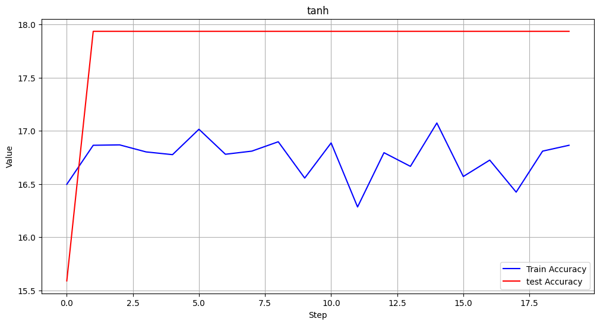

# Intel Image Classification with Pytorch


This project aims to classify images into six different scenes: buildings, forest, glacier, mountain, sea, and street. The images are categorized using deep learning techniques implemented in PyTorch. The dataset used for this project was directly downloaded from [Kaggle](https://www.kaggle.com/puneet6060/intel-image-classification) and was originally published for the Analytics Vidhya Intel Image Classification Challenge. We extend our gratitude to both Kaggle and Analytics Vidhya for providing this dataset.

## Table of Contents

- [Intel Image Classification with Pytorch](#intel-image-classification-with-pytorch)
  - [Table of Contents](#table-of-contents)
  - [Overview](#overview)
  - [Dataset](#dataset)
      - [FiftyOne: Dataset Exploration and Visualization](#fiftyone-dataset-exploration-and-visualization)
          - [key Features of Fifty-One:](#key-features-of-fifty-one)
  - [Training Process](#training-process)
      - [Models used :](#models-used-)
        - [simple model](#simple-model)
        - [Simple Model with Norm and Dropout](#simple-model-with-norm-and-dropout)
        - [Sigmoid and Tanh Activation Models](#sigmoid-and-tanh-activation-models)
          - [Sigmoid Activation Model](#sigmoid-activation-model)
          - [Tanh Activation Model](#tanh-activation-model)

## Overview

In this image classification project, we explored the performance of four different models for classifying the dataset into six distinct scenes: buildings, forest, glacier, mountain, sea, and street. Each model has distinct characteristics that we examined to understand their impact on classification accuracy and training convergence.

- Simple Model: The first model we used is a straightforward architecture for image classification. It consists of a `stack of convolutional layers followed by fully connected layers` for prediction.

- Sigmoid Activation Model: In the second model, we used the same architecture as the simple model but applied the `sigmoid activation function` throughout the network. This activation function introduces non-linearity, which can influence the model's decision boundaries.

- Tanh Activation Model: The third model shares the same architecture as the previous models but employs the `hyperbolic tangent (tanh) activation function` instead. Tanh is another non-linear activation function that can provide different characteristics to the model.

- Normalized and Dropout Model: For the fourth model, we incorporated two additional techniques: `batch normalization` and `dropout`. Batch normalization normalizes the activations in each layer, which can help stabilize and accelerate the training process. Dropout randomly deactivates certain neurons during training, preventing overfitting and improving generalization

## Dataset

#### FiftyOne: Dataset Exploration and Visualization

Fifty-One is an open-source library that empowers data scientists and machine learning practitioners with powerful tools for analyzing and visualizing machine learning datasets. While particularly well-suited for image and video data, Fifty-One can handle a variety of data types. Its main objective is to bridge the gap in the machine learning pipeline by providing comprehensive visual explorations, dataset comparisons, and label inspections, enabling users to gain a deeper understanding of their datasets.


###### key Features of Fifty-One:

1. Visual Exploration: Fifty-One offers robust visualization tools, particularly beneficial for image and video data. Interactive visualizations help uncover valuable insights.

2. Label Inspection: With Fifty-One, inspecting and verifying dataset labels becomes effortless, aiding in identifying potential labeling errors or inconsistencies.

3. Dataset Comparison: Users can easily compare different datasets or versions of the same dataset, facilitating analysis of data cleaning and augmentation effects.

4. Integration with Machine Learning Libraries: Fifty-One seamlessly integrates with popular machine learning libraries such as PyTorch and TensorFlow, simplifying its incorporation into existing workflows.

5. Scalability: Designed to handle large datasets, Fifty-One proves to be a practical tool for real-world machine learning projects.


    

https://github.com/erfanakk/Intel_classification/assets/87381197/1f9ca9ba-17b0-47ca-8b07-59da7a96f5fc


In this video, we showcase the capabilities of FiftyOne in enhancing the dataset curation process, analyzing class distributions.


## Training Process
In this section, we present a comparison of the training and test accuracy for each of the four models used in our image classification project:

#### Models used :
    1. simple model 
    2. simple model with norm and dropout
    3. modal sigmoid
    4. model tanh
    

##### simple model 

 - The simple model demonstrates reasonable performance during training, achieving high accuracy on the training data. However, it appears to suffer from overfitting, as the accuracy on the test data is comparatively lower.


``` Conv2D -> ReLU -> Conv2D -> ReLU -> MaxPool -> Conv2D -> ReLUConv2D -> ReLU -> MaxPool -> Flatten -> FC -> ReLU -> FC -> ReLU -> FC ```


Training and Test Accuracy:
    


In the graph above, the blue line represents the training accuracy, while the red line represents the test accuracy. The increasing gap between the two lines indicates the model's tendency to overfit the training data, resulting in reduced generalization to unseen data.

To improve the model's performance and mitigate overfitting, we may consider techniques like dropout, batch normalization, or early stopping during training. Experimenting with different hyperparameters could also help achieve a better balance between training and test accuracy.


##### Simple Model with Norm and Dropout

 -  By incorporating batch normalization layers and dropout regularization, we effectively alleviate overfitting, resulting in a more balanced training and test accuracy. While the training accuracy might be slightly lower compared to the simple model, this trade-off is beneficial as we achieve better generalization to unseen data and prevent overfitting issues.


``` Conv2D -> ReLU -> BatchNorm -> Conv2D -> ReLU -> MaxPool -> Conv2D -> ReLU -> BatchNorm -> Conv2D -> ReLU -> MaxPool -> Conv2D -> ReLU -> Conv2D -> ReLU -> MaxPool -> Flatten -> FC -> ReLU -> Dropout -> FC -> ReLU -> FC```


Training and Test Accuracy:


n the graph above, the blue line represents the training accuracy, while the red line represents the test accuracy. The smaller gap between the two lines clearly indicates that the model is not overfitting to the training data. Instead, it demonstrates better generalization capabilities, allowing it to perform well on unseen test data.


##### Sigmoid and Tanh Activation Models

The sigmoid and tanh activation models, while having distinct characteristics, did not perform as well in terms of accuracy compared to the other models in our image classification project.

###### Sigmoid Activation Model

The sigmoid activation model uses the same architecture as the simple model but replaces the activation function with sigmoid for all layers, including the output layer.

``` Conv2D -> Sigmoid -> Conv2D -> Sigmoid -> MaxPool -> Conv2D -> Sigmoid -> Conv2D -> Sigmoid -> MaxPool -> Conv2D -> Sigmoid -> Conv2D -> Sigmoid -> MaxPool -> Flatten -> FC -> Sigmoid -> FC -> Sigmoid -> FC ```

Training and Test Accuracy:


###### Tanh Activation Model

Similarly, the tanh activation model retains the same architecture as the simple model but replaces the activation function with tanh for all layers.

```Conv2D -> Tanh -> Conv2D -> Tanh -> MaxPool -> Conv2D -> Tanh -> Conv2D -> Tanh -> MaxPool -> Conv2D -> Tanh -> Conv2D -> Tanh -> MaxPool-> Flatten -> FC -> Tanh -> FC -> Tanh -> FC```

Training and Test Accuracy:




[in progers]
